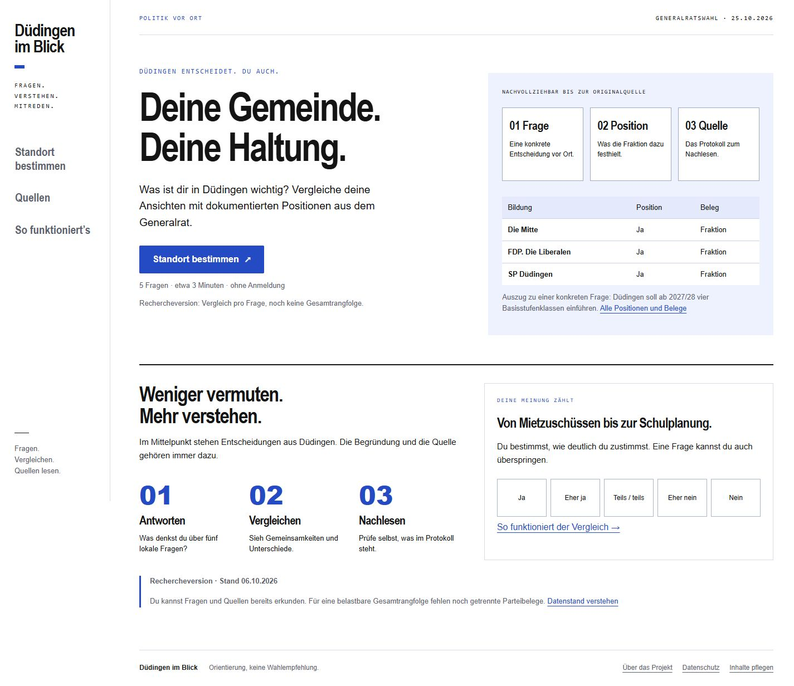

# Düdingen im Blick

Web-App zur politischen Standortbestimmung, umgesetzt in der freigegebenen Gestaltung **C – Klartext**. Statische Website für Netlify, ohne externe Laufzeitbibliotheken, Benutzerkonten oder Speicherung politischer Antworten.

**Stand: funktionsfähige Rechercheversion, noch keine fachlich freigegebene Wahlhilfe.** Fünf Fragen zeigen 14 belegte Parteipositionen. Für eine faire Gesamtrangfolge fehlen getrennte Belege für alle Listen. Die App zeigt deshalb Vergleiche pro Frage und erklärt die Lücken. Sie erzeugt keine erfundenen Gesamtwerte.

## Enthalten

- Startseite, fünf Fragen mit Antwortskala und Überspringen, Antwortübersicht, Änderungen und Zurücksetzen.
- Vergleich aller sechs amtlichen Listen für die Generalratswahl am **25. Oktober 2026**.
- Je Frage: eigene Antwort, belegte Position, Nähe, Herleitung, Evidenzgrad und Originalquelle mit Seitenangabe.
- Quellenansicht mit Such- und Jahresfilter; Verzeichnis von 28 Protokollen, Publikationszeitraum 2021–2026.
- Transparentes Matching, Gewichtungen, Mindestumfang, Gleichstände und Sperre bei ungenügender gemeinsamer Grundlage.
- Teilen über die Gerätefunktion bzw. Kopieren oder Textdownload. Keine Einzelantworten im Export.
- Lokaler Inhaltseditor unter `/editor.html`: Fragen, Parteien, Positionen, Belege, Gewichte, Antworttexte und Parameter; JSON-Import und -Export.
- Datenschutz- und Projektseiten, Fehlerseite, Tastaturbedienung, responsive Ansichten, Netlify-Konfiguration und automatische Tests.

## Lokal ansehen

Node.js 22 oder neuer genügt; keine Abhängigkeiten sind zu installieren.

```sh
npm run dev
```

Dann `http://127.0.0.1:4173` öffnen. Die App benötigt einen lokalen Webserver; direktes Öffnen von `index.html` als Datei funktioniert wegen der Datenabrufe nicht zuverlässig.

```sh
npm test
npm run check:data
npm run build
node scripts/serve.mjs --dist
```

## In Netlify veröffentlichen

Das Repository `adijou/wahlinfo` als bestehendes Projekt importieren:

| Einstellung | Wert |
|---|---|
| Branch | `main` |
| Base directory | leer / Repository-Wurzel |
| Build command | `npm run build` |
| Publish directory | `dist` |
| Node | `22` (bereits in `netlify.toml`) |
| Umgebungsvariablen / API-Schlüssel | keine |

Die Einstellungen und Sicherheitsheader sind in `netlify.toml` vorbereitet. Alternativ kann der lokal erzeugte Ordner `dist` per manuellem Upload bereitgestellt werden. Netlify-Deployment wurde im Rahmen dieser Umsetzung **nicht** ausgeführt.

Die aktuelle Fassung bleibt sichtbar eine Rechercheversion und enthält `noindex,nofollow`. Eine Veröffentlichung dieser Vorschau ist technisch möglich, erfüllt aber noch nicht die fachlichen Abnahmekriterien des Pflichtenhefts.

Bei einem fehlerhaften Update den betreffenden GitHub-Commit rückgängig machen und den letzten geprüften Stand erneut bauen/veröffentlichen. Daten und Anwendung sollten immer gemeinsam auf einen passenden Stand zurückgesetzt werden.

## Daten pflegen

1. In der App unten **Inhalte pflegen** öffnen.
2. Felder anpassen. Neue Fragen zunächst inaktiv lassen, bis unterschiedliche Positionen ausreichend belegt sind.
3. Mit **Daten prüfen** Quellenkennungen, Fundstellen, Gewichte und Zuordnungen kontrollieren.
4. **Geprüfte Datei herunterladen** wählen; `public/data/politics.json` im Repository damit ersetzen.
5. Datenversion aktualisieren, Änderung mit Quelle im Commit beschreiben, Tests und Build ausführen.

Der Editor arbeitet vollständig lokal. Er hat keinen Serverzugriff; Besucher können damit die veröffentlichte Website nicht verändern. Ein Login ist deshalb nicht erforderlich. Nicht exportierte Änderungen gehen beim Schliessen verloren. **Entwurf sichern** ermöglicht einen Zwischenstand; fehlerhafte Entwürfe müssen vor dem Import bzw. Build korrigiert werden.

`scripts/prepare-data.py` dokumentiert die ursprüngliche redaktionelle Seed-Erstellung. Nach manuellen Änderungen nicht erneut ausführen: Es würde die JSON-Datei mit diesem ursprünglichen Stand überschreiben. Es ist kein Bestandteil des Builds. Die optionale Recherche benötigt Python und `pypdf`; Endnutzer und Netlify benötigen beides nicht.

## Fachlicher Datenstand

Die sechs Listen sind anhand des [amtlichen Kandidierendenverzeichnisses vom 21.09.2026](https://www.duedingen.ch/_doc/7241566) abgeglichen: Die Mitte, SP, FDP, Freie Wähler Düdingen, SVP sowie Mitte Links/Grüne/glp. Der [amtliche Oktober-Mitteilungsblatt, Seite 3](https://www.duedingen.ch/_doc/7263406), bestätigt den Termin. Die frühere Junge Liste ist keine eigene aktuelle Liste; ihre Positionen werden keiner anderen Partei übertragen.

28 Protokolle sind erfasst, **nicht vollständig ausgewertet**. Fünf ausgewählte Sitzungen von Februar 2025 bis Juni 2026 bilden die aktuelle Fragenbasis. Alle 14 verwendeten Parteikodierungen haben mittlere Evidenz: eindeutige Fraktionsaussagen oder ausdrücklich zugeordnete Anträge/Vernehmlassungen, keine namentlichen Abstimmungsnachweise. Aus Gesamtresultaten werden keine Parteistimmen errechnet.

FWD und Mitte Links/Grüne/glp bildeten eine gemeinsame Fraktion. Deren Aussagen sind in den Details lesbar, werden jedoch nicht als zwei separate Parteipositionen gezählt. Mit der aktuellen Datenlage gibt es daher **keine gemeinsam belegte Frage für alle sechs Listen**. Der Rechenweg funktioniert und ist getestet; die Rangfolge bleibt aus fachlichen Gründen gesperrt.

Vor einer fachlichen Freigabe fehlen:

- Weiterführende systematische Auswertung und eine ausreichend breite, für alle Listen vergleichbare Belegbasis. Nicht vorhandene Belege dürfen nicht ergänzt oder aus allgemeinen Parteiprogrammen abgeleitet werden.
- Redaktionelle Gegenprüfung der Fragen, Interpretationen und historischen Zuordnung.
- Benennung der verantwortlichen Person und des Korrekturkontakts sowie Ergänzung der Angaben zum konkreten Hostingbetrieb.
- Abschluss der Prüfung in weiteren Browsern und mit Screenreader, falls eine entsprechende Barrierefreiheitszusage gemacht werden soll.

`release: "published"` wird vom Validator nur akzeptiert, wenn Verantwortlichkeit, bestätigte Wahldaten, dokumentierte Gegenprüfung (`review.reviewer`, `review.date`) und eine ausreichende gemeinsame Vergleichsbasis vorliegen. Eine technische Prüfung ersetzt keine fachliche Freigabe. Nach dieser Freigabe kann auch die Suchmaschinen-Sperre in `public/index.html` entfernt werden.

## Methodik und Prüfung

Antworten: 100 / 75 / 50 / 25 / 0. Nähe: `100 − |Antwort − Parteiposition|`. Gesamtwert: gewichteter Mittelwert auf **denselben** belegten und beantworteten Fragen für alle Listen der festen Vergleichsgruppe. Mindestumfang: vier Fragen aus drei Bereichen. Alle Gewichte sind zunächst 1. Fehlende Angaben sind `null`, niemals 0; Einzelpersonen und gemeinsame Fraktionen sind von der Parteiberechnung ausgeschlossen.

Siehe [Quellen- und Kodierungsprüfung](docs/DATENPRUEFUNG.md), [Prüfprotokoll](docs/QA.md) und [Gestaltung](DESIGN.md).

Die Seite ruft nur eigene statische Dateien ab. Politische Antworten verbleiben im Arbeitsspeicher des aktuellen Browserdokuments. Keine Cookies, kein Local Storage, kein Tracking, keine extern geladenen Schriften oder Bilder.

## Vorschau



[Smartphone-Frage ansehen](docs/screenshots/mobile-frage.jpg)
